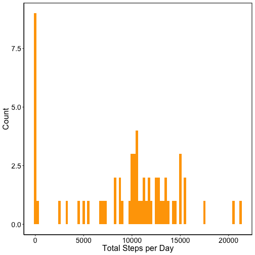
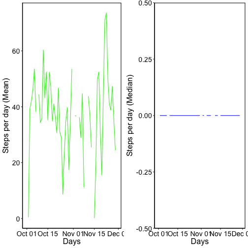
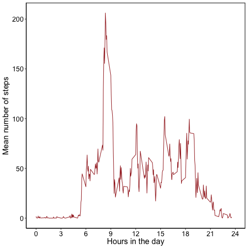
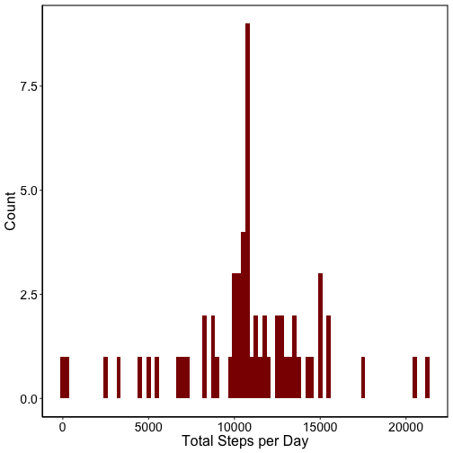
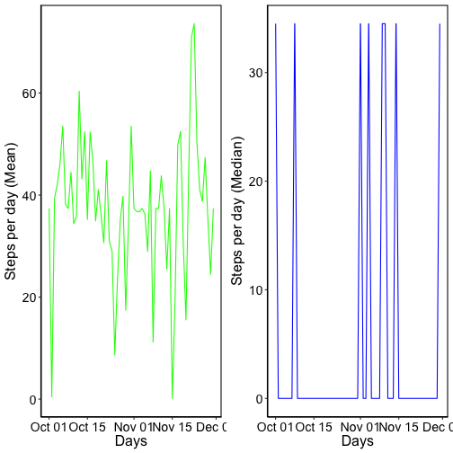
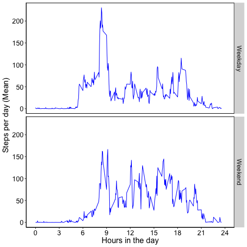

# Peer Assignment Solutions (Activity Data)

This is my solution for the fist peer-graded assignment in the Reproducible Research Coursera course.
It is also my first attempt at using knitr to create an Rmd file and generate a html output using
RStudio.

I will start by initializing the tidyverse library, and reading in the activity dataset.

### Initializing libraries and downloading the data


```r
library('tidyverse') 
```

```r
## url to download the activity data
url <- 'https://d396qusza40orc.cloudfront.net/repdata%2Fdata%2Factivity.zip'

## downloading the file
download.file(url, destfile = 'activity_data.zip', method='curl')

## check to see if the file exists, if not, unzip it
if(!file.exists('activity.csv')) {
        unzip('activity_data.zip')
```

### Reading in the data

I am going to read-in the data using the readr package (which is built into tidyverse). As part of the read_csv command, let's specify the data types for each of the columns in the dataset (readr generally reads in the first 100 lines of the file to determine the data-type of the column). If the data type is not specified, readr will assume the dates column to be characters. Instead, let's explicitly specify that it contains dates (as well as the format). Let's also  take a look at the first few rows of the file.


```r
## Read-in the file. I'm also specifying the class of each column (to deal with the dates)
ActivityFile <- read_csv('activity.csv',col_types = list(col_integer(),
                        col_date(format = '%Y-%m-%d'),col_integer()))
ActivityFile[1:3,]
```

```
## # A tibble: 3 x 3
##   steps date       interval
##   <int> <date>        <int>
## 1    NA 2012-10-01        0
## 2    NA 2012-10-01        5
## 3    NA 2012-10-01       10
```

Now that the data has been read-in, let's start working on the assignment questions.

### What is the mean total number of steps taken per day?

For the first question, let's ignore the existence of missing values in the dataset. I will be using the dplyr package to answer most of the questions in this assignment. Let's start by grouping the data by date and calculating  the total number of steps taken every day using sum. I am not going to print the results in the document. Instead, we will visualize the data using a histogram.


```r
## Calculate the total number of steps taken every day
q1 <- ActivityFile %>% group_by(date) %>% 
        summarise(sm = sum(steps, na.rm=T))
print(q1)
```

### A histogram of the total number of steps taken per day.

I am going to use ggplot for this exercise, primarily to learn generating plots with ggplot2.


```r
## Plot a histogram of the total number of steps taken per day
ggplot(data = q1, aes(sm)) +
        geom_histogram(fill='orange', binwidth = 250, stat='bin', na.rm = T) +
        labs(x = 'Total Steps per Day', y = 'Count') +
        theme(axis.line.x = element_line(size = 0.5, colour = "black"),
              axis.line.y = element_line(size = 0.5, colour = "black"),
              axis.line = element_line(size=1, colour = "black"),
              panel.grid.major = element_blank(),
              panel.grid.minor = element_blank(),
              panel.border = element_rect(color = "black", size = 1, fill = NA),
              panel.background = element_blank(),
              plot.title=element_text(size = 20, family="Arial"),
              text=element_text(size = 16, family="Arial"),
              axis.text.x=element_text(colour="black", size = 14),
              axis.text.y=element_text(colour="black", size = 14))
```



It is interesting to note in the plot, that there the count of days with 0 steps is quite large. It will be interesting to keep an eye out to see how this will change, when we impute missing values later in the assignment 

### The mean and median number of steps each day.

Again, I'm going to use dplyr to quickly group the data by dates, and calculate the mean and median number of steps taken each day. In lieu of printing out the results in numerical form, let's visualize them as line plots.


```r
## Calculate the medan and median number of steps taken each day.
q2 <- ActivityFile %>% group_by(date) %>% 
        summarise(mn = mean(steps, na.rm=T), md = median(steps, na.rm = T))
## Let's take a quick look at the mean number of steps taken each day
print(q2)
```

Since, the number of rows in q2 is quite large, a line plot should be easy to visualize.


```r
require(gridExtra)

## Plotting the mean number of steps taken each day
p1 <- ggplot(data = q2, aes(x = date, y= mn)) +
        geom_line( color = 'green', na.rm = T) +
        labs(x = 'Days', y = 'Steps per day (Mean)') +
        theme(axis.line.x = element_line(size = 0.5, colour = "black"),
              axis.line.y = element_line(size = 0.5, colour = "black"),
              axis.line = element_line(size=1, colour = "black"),
              panel.grid.major = element_blank(),
              panel.grid.minor = element_blank(),
              panel.border = element_rect(color = "black", size = 1, fill = NA),
              panel.background = element_blank(),
              plot.title=element_text(size = 20, family="Arial"),
              text=element_text(size = 16, family="Arial"),
              axis.text.x=element_text(colour="black", size = 14),
              axis.text.y=element_text(colour="black", size = 14))

## Plotting the median number of steps taken each day
p2 <- ggplot(data = q2, aes(x = date, y= md)) +
        geom_line( color = 'blue', na.rm = T) +
        labs(x = 'Days', y = 'Steps per day (Median)') +
        theme(axis.line.x = element_line(size = 0.5, colour = "black"),
              axis.line.y = element_line(size = 0.5, colour = "black"),
              axis.line = element_line(size=1, colour = "black"),
              panel.grid.major = element_blank(),
              panel.grid.minor = element_blank(),
              panel.border = element_rect(color = "black", size = 1, fill = NA),
              panel.background = element_blank(),
              plot.title=element_text(size = 20, family="Arial"),
              text=element_text(size = 16, family="Arial"),
              axis.text.x=element_text(colour="black", size = 14),
              axis.text.y=element_text(colour="black", size = 14))

grid.arrange(p1, p2, ncol=2)
```



## What is the average daily activity pattern?

### A time series plot of the 5-minute interval (x- axis) versus average number of steps taken (across all days)

To generate this plot, let's group the data by interval using dplyr and calculate the mean number of steps taken in each interval. A quick look at the intervals tells us that it consists on 5 minute intervals from 0 to 2355 - representing the 24 hours of the day. Wouldn't it be neat if our x-axis showed hours of the days from 1 to 24? To achieve this, I created a column called new.int (which is int/100).
Note: While typical time intervals run from 1 to 60, in this dataset, intervals run from 0 to 55 (eg. 0-55, 100-155, 200-255 etc.).

```r
q3 <- ActivityFile %>% group_by(interval) %>% 
        summarize(mn = mean(steps,na.rm = T)) %>%
        mutate(new.int = interval/100)
print(q3)
```

Let's take a look at the plot.


```r
p3 <- ggplot(data = q3, aes(x = new.int, y= mn)) +
        geom_line( color = 'brown', na.rm = T) +
        labs(x = 'Hours in the day', y = 'Mean number of steps') +
        scale_x_continuous(limits = c(0,24), breaks = seq(0,24,3)) +
        theme(axis.line.x = element_line(size = 0.5, colour = "black"),
              axis.line.y = element_line(size = 0.5, colour = "black"),
              axis.line = element_line(size=1, colour = "black"),
              panel.grid.major = element_blank(),
              panel.grid.minor = element_blank(),
              panel.border = element_rect(color = "black", size = 1, fill = NA),
              panel.background = element_blank(),
              plot.title=element_text(size = 20, family="Arial"),
              text=element_text(size = 16, family="Arial"),
              axis.text.x=element_text(colour="black", size = 14),
              axis.text.y=element_text(colour="black", size = 14))
p3
```



It is interesting to note that there's a spike in activity early in the morning (around 9 A.M.), with peridic spikes in activity around noon, and between 5 - 7 P.M. Also, as expected, there's little to no activity between the hours between 9 P.M to 6 A.M.

## Dealing with missing values in the dataset

As with most real-world data, this data has missing values as well. How can we determine the number of missing values in this dataset. (The assumption is that the dates/intervals are fixed and therefore contain no missing values.)

### How many missing values in this dataset?


```r
## Total number of missing values in the dataset
q4_a <- sum(is.na(ActivityFile)) 

cat('The number of missing values in this dataset is:',q4_a)
```

```
## The number of missing values in this dataset is: 2304
```

### Imputing missing values

Here, the missing values (number of steps) in the dataset are imputed using a simple approach - replace the NAs with the mean value for that specific interval. A custom function called impute.miss.val does exactly that.


```r
## Let's write a simple function that will impute missing values by rounding the vales of the mean number of steps for that interval
impute.miss.val <- function(df) {
        ## How many unique intervals in the dataset
        uni_inter <- unique(df$interval)
        ## Let's iterate through each interval
        for (i in 1:length(uni_inter)) {
                # Get values for the current interval
                cur.inter <- df$steps[df$interval==uni_inter[i]]
                # Replace NAs with the mean for that interval
                cur.inter[is.na(cur.inter)] <- round(mean(cur.inter, na.rm = T))
                ## Assign the filled in values back to the DF
                df$steps[df$interval==uni_inter[i]] <- cur.inter
        }
return(df)
}
```

Now that the function is written, let's fill-in the missing values.


```r
## Let's fill in the missing values using the impute.miss.val function
New.ActivityFile <- impute.miss.val(ActivityFile)

## How many missing values after imputing the missing values
cat('Number of missing values in this dataset is:',sum(is.na(New.ActivityFile)))
```

```
## Number of missing values in this dataset is: 0
```

Now that we have imputed the missing values, let's recalculate the total number of steps taken each day and visualize it using a histogram.


```r
## Calculate the total number of steps taken every day
q4_b <- New.ActivityFile %>% group_by(date) %>% 
        summarise(total = sum(steps, na.rm=T))

## Histogram of the total number of steps taken each day
ggplot(data = q4_b, aes(total)) +
        geom_histogram(fill='dark red', binwidth = 250, stat='bin', na.rm = T) +
        labs(x = 'Total Steps per Day', y = 'Count') +
        theme(axis.line.x = element_line(size = 0.5, colour = "black"),
              axis.line.y = element_line(size = 0.5, colour = "black"),
              axis.line = element_line(size=1, colour = "black"),
              panel.grid.major = element_blank(),
              panel.grid.minor = element_blank(),
              panel.border = element_rect(color = "black", size = 1, fill = NA),
              panel.background = element_blank(),
              plot.title=element_text(size = 20, family="Arial"),
              text=element_text(size = 16, family="Arial"),
              axis.text.x=element_text(colour="black", size = 14),
              axis.text.y=element_text(colour="black", size = 14))
```



If we compare this histogram to the first one we generated, its obvious that the nunber of days with 0 steps has almost disappeared, and the number of days with 10,000 steps has a corresponding increase.

### How does imputing the missing values alter the mean/median number of steps taken each day?


```r
q4_c <- New.ActivityFile %>% group_by(date) %>% 
        summarise(mn = mean(steps, na.rm=T), md = median(steps, na.rm = T))

p4a <- ggplot(data = q4_c, aes(x = date, y= mn)) +
        geom_line( color = 'green', na.rm = T) +
        labs(x = 'Days', y = 'Steps per day (Mean)') +
        theme(axis.line.x = element_line(size = 0.5, colour = "black"),
              axis.line.y = element_line(size = 0.5, colour = "black"),
              axis.line = element_line(size=1, colour = "black"),
              panel.grid.major = element_blank(),
              panel.grid.minor = element_blank(),
              panel.border = element_rect(color = "black", size = 1, fill = NA),
              panel.background = element_blank(),
              plot.title=element_text(size = 20, family="Arial"),
              text=element_text(size = 16, family="Arial"),
              axis.text.x=element_text(colour="black", size = 14),
              axis.text.y=element_text(colour="black", size = 14))

## Plotting the mean number of steps taken each day
p4b <- ggplot(data = q4_c, aes(x = date, y= md)) +
        geom_line( color = 'blue', na.rm = T) +
        labs(x = 'Days', y = 'Steps per day (Median)') +
        theme(axis.line.x = element_line(size = 0.5, colour = "black"),
              axis.line.y = element_line(size = 0.5, colour = "black"),
              axis.line = element_line(size=1, colour = "black"),
              panel.grid.major = element_blank(),
              panel.grid.minor = element_blank(),
              panel.border = element_rect(color = "black", size = 1, fill = NA),
              panel.background = element_blank(),
              plot.title=element_text(size = 20, family="Arial"),
              text=element_text(size = 16, family="Arial"),
              axis.text.x=element_text(colour="black", size = 14),
              axis.text.y=element_text(colour="black", size = 14))
require(gridExtra)
grid.arrange(p4a, p4b, ncol=2)
```



### How do the activity levels change between Weekdays and Weekends?

Once again, let's apply dplyr to create a new column called wekday that will assign Weekday to days from Monday to Friday, and Weekend to Saturday and Sunday. Let's set the intervals again from 0 to 24.


```r
## Number of steps Weekdays versus Weekends
wkday <- c('Monday', 'Tuesday','Wednesday','Thursday','Friday')

q5 <- New.ActivityFile %>% 
        mutate(wekday = ifelse(weekdays(date) %in% wkday, 'Weekday', 'Weekend')) %>%
        group_by(wekday,interval) %>% summarize(mn = mean(steps)) %>%
        mutate(new.int = (interval/100))
```

Finally, to recreate the plot from the assignment, Let's use ggplot and apply 'wekday' as the facet_grid variable.


```r
ggplot(data = q5, aes(x = new.int, y= mn)) +
        geom_line( color = 'blue', na.rm = T) +
        facet_grid(wekday ~.) +
        labs(x = 'Hours in the day', y = 'Steps per day (Mean)') +
        scale_x_continuous(limits=c(0,24), breaks = seq(0,24,3)) +
        theme(axis.line.x = element_line(size = 0.5, colour = "black"),
              axis.line.y = element_line(size = 0.5, colour = "black"),
              axis.line = element_line(size=1, colour = "black"),
              panel.grid.major = element_blank(),
              panel.grid.minor = element_blank(),
              panel.border = element_rect(color = "black", size = 1, fill = NA),
              panel.background = element_blank(),
              plot.title=element_text(size = 20, family="Arial"),
              text=element_text(size = 16, family="Arial"),
              axis.text.x=element_text(colour="black", size = 14),
              axis.text.y=element_text(colour="black", size = 14))
```


